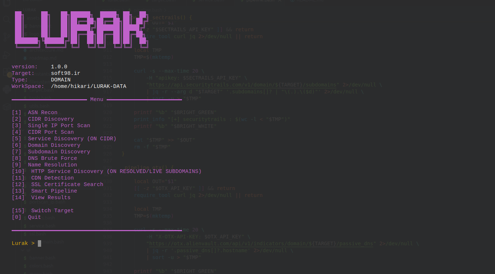
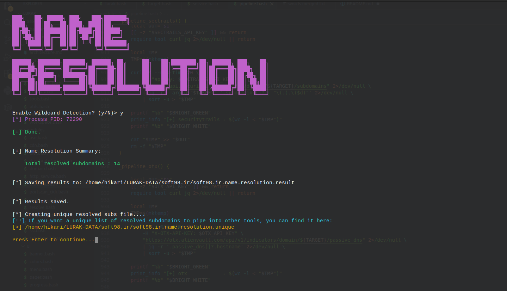
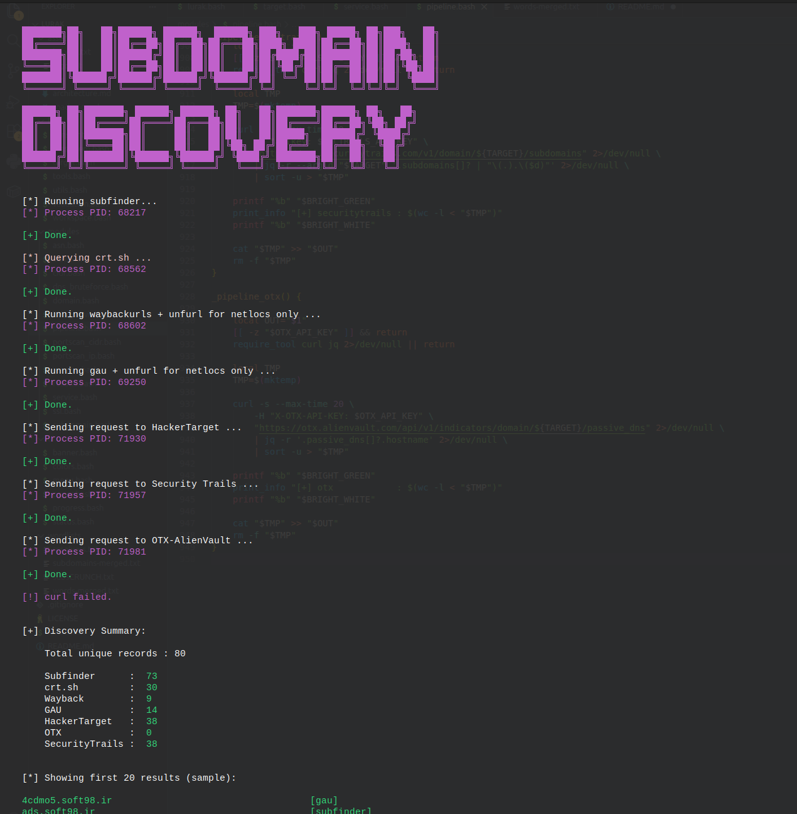
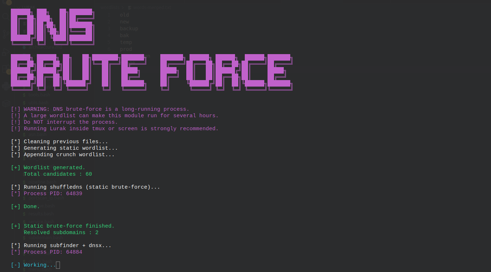
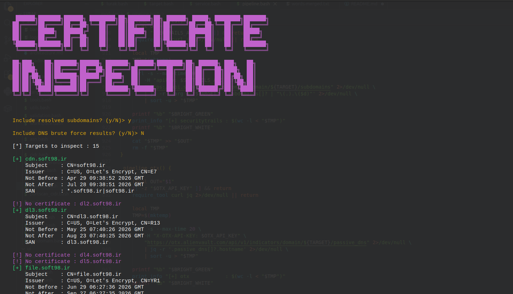
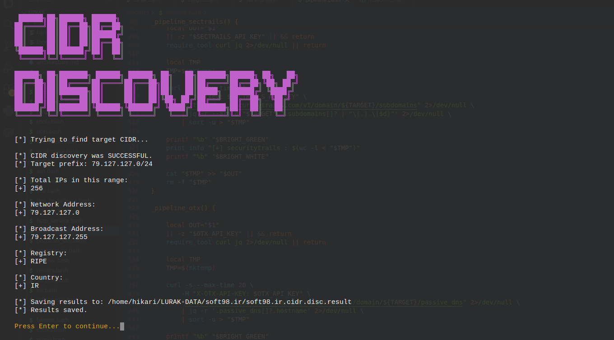
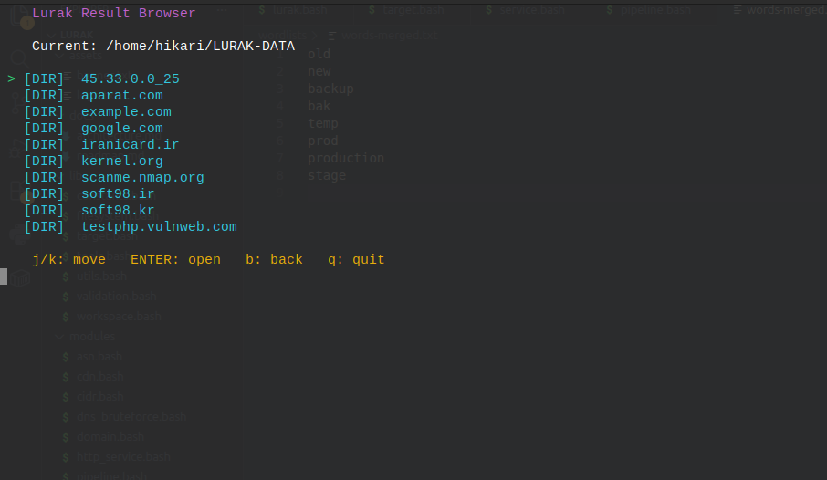

# Lurak

> Lightweight modular reconnaissance framework for Web Application Security and Penetration Testing.

<p align="center">
  
</p>

---

## About the Name

**Lurak** comes from two ideas:

- **Lurk** — quietly observing a target before taking action.
- **AK** — a short suffix representing action and execution.

The name reflects the philosophy behind the project:

> **Observe first. Understand the target. Then act.**

Lurak is intentionally focused on reconnaissance rather than exploitation.

---

## Why I Built Lurak

Modern reconnaissance usually involves dozens of independent tools. One enumerates subdomains, another resolves DNS, another scans ports, another fingerprints HTTP services, another inspects certificates, another performs ASN lookups. Each tool is excellent on its own, but chaining them together during a real assessment gets repetitive fast:

```
Tool A → save output → clean output → feed into Tool B → clean output → feed into Tool C → repeat...
```

That workflow is easy to break, hard to repeat consistently, and wastes time during engagements. I built Lurak to solve exactly this problem — not by replacing existing recon tools, but by orchestrating them inside a consistent, repeatable workflow while keeping every step transparent.

Every module can still be run on its own. Outputs remain reusable. Nothing is hidden behind proprietary logic — the framework just removes the repetitive glue work between tools, so I (or anyone running it) can spend more time thinking about the target and less time babysitting output formats.

---

## Philosophy

- Keep modules independent.
- Produce reusable output.
- Never hide what external tools are doing.
- Prefer transparency over abstraction.
- Make reconnaissance repeatable.
- Stay lightweight.
- Avoid unnecessary dependencies.
- Work naturally inside Linux environments.

Lurak intentionally avoids becoming another monolithic scanner. Instead, it's a collection of focused reconnaissance modules that work well together.

---

## Features

- Interactive terminal interface
- Modular architecture
- Passive and active reconnaissance
- ASN intelligence
- CIDR discovery
- Subdomain enumeration
- DNS brute forcing
- Name resolution
- HTTP service discovery
- CDN detection
- SSL/TLS inspection
- Smart Pipeline for end-to-end automation
- Structured JSON output + reusable flat files
- Linux-first design, written entirely in Bash

---

## Architecture

```
                     Target
                        │
                        ▼
                Target Detection
                        │
        ┌───────────────┼───────────────┐
        │               │               │
        ▼               ▼               ▼
     DOMAIN            IP             CIDR
        │               │               │
        └───────────────┼───────────────┘
                        ▼
                Individual Modules
                        │
                        ▼
              Structured Output Files
                        │
                        ▼
                 Smart Pipeline
                        │
                        ▼
              ~/LURAK-DATA/<target>/
```

The framework is organized around independent modules, each solving one specific problem. Output from one module can be reused by another without re-running the original command — this keeps the workflow modular and makes Lurak useful even when only a single recon task is needed.

---

## Project Structure

```text
Lurak/
├── lib/
├── modules/
├── ui/
├── wordlists/
├── images/
├── assets/
├── lurak.bash
└── README.md
```

---

## Modules

Lurak currently ships fourteen reconnaissance modules. Each one runs independently, and together they cover the full recon lifecycle.

### [1] ASN Recon
Resolves the target to an IP, queries Team Cymru (`whois.cymru.com`) for the ASN number, then pulls organization name, description, contact emails, and all IPv4/IPv6 prefixes registered under that ASN from RADB. Useful for understanding the full IP space owned by a target before deciding what to scan.

**Tools:** `whois`, `dig`

---

### [2] CIDR Discovery
Given a domain or IP, resolves it and uses `whois` to extract the network prefix (CIDR range) it belongs to. Returns network address, broadcast address, total IP count, registry, country, and organization. Accepts a CIDR as direct input too — in that case it skips resolution and uses the provided range directly.

**Tools:** `whois`, `dig`

---

### [3] Single IP Port Scan
Interactive port scanner for a single IP target. Lets you choose port range (top ports / custom range / specific ports), scan speed, scan type (SYN/TCP connect), and optionally add decoy IPs (`-D RND:20,ME`) to blend into traffic. Runs `nmap` with `sudo` and parses open ports from output.

**Tools:** `nmap`, `dig`

> **Note:** SYN scan requires sudo. Decoy mode adds random source IPs to the scan — useful for noisy environments, but does not guarantee anonymity.

---

### [4] CIDR Port Scan
Scans an entire CIDR range for open ports using `naabu`. Resolves the CIDR from the target if not provided directly, confirms with the user before starting, and allows configuring port range and scan rate. Results are saved and used as input by the Service Discovery module.

**Tools:** `naabu`, `whois`, `dig`

> **Note:** Running this on large ranges (e.g. /16) with high rates can be very noisy. Recommended to run from a VPS or dedicated recon server inside a `tmux` session.

---

### [5] Service Discovery
Reads the CIDR port scan output and probes each open endpoint to fingerprint services.
- **Port 22:** grabs the SSH banner via `nc`
- **Port 80/81/8080/...:** sends an HTTP HEAD request via `curl`, extracts status code and `Server` header
- **Port 443/8443:** same over HTTPS (`-k` for self-signed certs)

Requires CIDR port scan (option 4) to have been run first.

**Tools:** `curl`, `nc`, `dig`, `jq`

---

### [6] Domain Discovery
Discovers other domains/IPs sharing the same infrastructure as the target, using four methods:

- **Cert SAN lookup:** for domains — queries `crt.sh` directly via PostgreSQL for all matching certificates. For IPs — grabs the cert on port 443 via `openssl` and extracts SANs.
- **Reverse IP lookup:** queries HackerTarget's reverse IP API for other domains hosted on the same IP.
- **Historical IP lookup:** queries Robtex's free passive DNS API for historical DNS records tied to the target's IP.
- **PTR record:** reverse DNS lookup via `dig -x`.

Only works on root domains and IPs — not subdomains.

**Tools:** `curl`, `openssl`, `jq`, `psql`, `dig`

> **Note:** `crt.sh`'s PostgreSQL endpoint can be unstable. The module retries up to 3 times with a delay. Results are best-effort OSINT — verify before taking action.

---

### [7] Subdomain Discovery
Passive subdomain enumeration from 7 sources, run sequentially:

| Source | Notes |
|---|---|
| `subfinder` | Multi-source passive enum |
| `crt.sh` | Direct PostgreSQL query (3 retry attempts) |
| `waybackurls` + `unfurl` | Extracts subdomains from Wayback Machine URLs |
| `gau` + `unfurl` | Extracts subdomains from GAU (Common Crawl, Wayback, etc.) |
| HackerTarget | Free API — rate limited |
| SecurityTrails | Requires API key in `lib/constants.bash` → `SECTRAILS_API_KEY` |
| OTX AlienVault | Requires API key in `lib/constants.bash` → `OTX_API_KEY` |

All results are merged, deduplicated, and saved as both a full JSON result and a flat unique list for piping into other modules.

**Tools:** `subfinder`, `psql`, `waybackurls`, `gau`, `unfurl`, `curl`, `jq`

> To use SecurityTrails or OTX, add your API keys to `lib/constants.bash`. `crt.sh` can be slow or down — if it fails after 3 attempts it's skipped and the rest continues.

---

### [8] DNS Brute Force
Three-phase active subdomain bruteforcing:

1. **Static brute force** — runs `shuffledns` against `wordlists/subdomains-merged.txt`
2. **Permutation generation** — feeds discovered subdomains into `dnsgen` with `wordlists/words-merged.txt` to generate permutation candidates
3. **Resolution** — resolves all candidates with `dnsx`, deduplicates with `anew`

Also runs a pass with `subfinder` on each discovered subdomain for deeper passive coverage.

**Tools:** `shuffledns`, `massdns`, `subfinder`, `dnsx`, `dnsgen`, `anew`

> **Wordlists:**
> - `wordlists/subdomains-merged.txt` — main brute-force list. Recommended: merge `best-dns-wordlist.txt` and `2m-subdomains.txt` from [wordlists-cdn.assetnote.io](https://wordlists-cdn.assetnote.io)
> - `wordlists/subsCRUNCH.txt` — all 3- and 4-character combinations, generated with `crunch`
> - `wordlists/words-merged.txt` — permutation words for `dnsgen`. Keep this small — output grows exponentially with larger lists.
> - `wordlists/resolvers.txt` — DNS resolver IPs for `shuffledns`/`massdns`. If the target has known name servers, add them here for more accurate results.

> **This module can run for several hours on large wordlists.** Strongly recommended to run on a remote server inside a `tmux` session rather than a local terminal.

---

### [9] Name Resolution
Takes the subdomain discovery output (`*.subdomain.discovery.unique`) and resolves which ones are actually live.

Two modes:
- **Standard:** runs `dnsx` directly — fast, no wildcard filtering
- **Wildcard detection:** runs `shuffledns` with wildcard detection enabled — slower but filters out wildcard DNS responses that would otherwise flood results

Output is saved as both a JSON result and a flat unique list used by downstream modules (CDN Detection, HTTP Service Discovery, SSL inspection).

**Tools:** `dnsx`, `shuffledns`, `jq`

> Run Subdomain Discovery (option 7) before this module.

---

### [10] HTTP Service Discovery
Runs `naabu` against all live subdomains to find open web ports, then probes each one with `curl` to check for live HTTP/HTTPS services. Extracts status codes, server headers, redirect targets, and page titles. Output includes a flat unique list of live URLs for easy piping.

Ports scanned: `80, 81, 443, 591, 593, 8000, 8008, 8080, 8081, 8088, 8443, 8888, 9000, 9090`

**Tools:** `curl`, `jq`, `naabu`

> Requires Name Resolution (option 9) output. If DNS Brute Force (option 8) was also run, you can optionally include those results too.

---

### [11] CDN Detection
Checks each live subdomain against a hardcoded list of known CDN ASN numbers. Resolves each subdomain to an IP, queries Team Cymru for its ASN, and matches against the list. Outputs two files: CDN-backed hosts and non-CDN hosts (potential direct-IP targets).

**CDN providers covered:** Cloudflare, CloudFront, Akamai, Azure CDN, Google Cloud, Fastly, Imperva, Incapsula, DigitalOcean, Alibaba, ArvanCloud, and more.

**Tools:** `dig`, `jq`, `whois`

> Requires Name Resolution (option 9) output. ASN-to-CDN mapping can change — the list in `cdn.bash` should be updated periodically. This module uses ASN matching only, not IP range comparison — it may miss CDN providers with non-standard ASN setups.

---

### [12] SSL Certificate Inspection
Grabs and inspects TLS certificates for the target and all live subdomains. Extracts subject, issuer, validity dates, and SAN entries.

- For IP targets: connects to port 443 directly
- For domain targets: also checks live subdomains from name resolution and DNS brute force results if available

**Tools:** `openssl`, `jq`

> For domains: run Subdomain Discovery (option 7) and Name Resolution (option 9) first to get cert data for the full subdomain surface, not just the root domain.

---

### [13] Smart Pipeline
Runs a full automated recon chain based on the target type, with no interactive prompts. All output is saved as plain text files in `~/LURAK-DATA/<target>/pipeline/`.

**DOMAIN chain:** Passive subdomain discovery → DNS brute force → Name resolution → HTTP service discovery → SSL certificate inspection → Domain discovery → ASN recon

**IP chain:** ASN recon → CIDR discovery → Port scan → SSL certificate inspection → Domain discovery

**CIDR chain:** CIDR info → ASN recon → Port scan → Service discovery

I designed Smart Pipeline to be self-contained, but by design it's not the deepest way to run a full engagement — and that's intentional. Instead of duplicating the same logic that already lives in the individual modules, it orchestrates the real modules in sequence with sensible, non-interactive defaults, so it stays lightweight rather than becoming another ~1,000-line copy of module logic. For a lighter, fully automated pass, use the pipeline as-is. For a deeper, fully customized engagement, follow the documented module flow and run each module individually — that's the recommended path for real assessments (see **Recommended Workflow** below).

---

### [14] View Results
Lists all saved result files for the current target.

---

## Manual Installation & Requirements

**Go-based tools** (install with `go install`):
```
subfinder, naabu, dnsx, shuffledns, waybackurls, gau, unfurl, anew, dnsgen
```

**System tools:**
```
nmap, whois, dig, curl, openssl, jq, psql, nc, massdns, crunch
```

**PostgreSQL client** (`psql`) is required for crt.sh queries:
```bash
sudo apt install postgresql-client
```

**Go tools path:** if installed via `go install`, binaries land in `~/go/bin/`. Add to PATH:
```bash
export PATH=$PATH:$HOME/go/bin
```

**`naabu` and `nmap`** require sudo for SYN scans. Either run Lurak as root or configure sudoers.

## Installation Script:
There is a script called `install.sh` in project root.
Make it executable and run it simply:
```bash
chmod +x ./install.sh
./install.sh
```

After that, you will have a symlink to `lurak.bash` file in `~/.local/bin` (PATH) and you can access it from anywhere.

---

## Wordlists

```
wordlists/
├── subdomains-merged.txt   # main brute-force wordlist
├── subsCRUNCH.txt          # 3-4 char combinations (generate with crunch)
├── words-merged.txt        # dnsgen permutation words (keep small)
└── resolvers.txt           # DNS resolvers for shuffledns/massdns
```

---

## Output

All results are saved to `~/LURAK-DATA/<target>/` as JSON files. Each module also writes a flat unique list (`.unique` suffix) for easy piping into external tools. Smart Pipeline results go into a `pipeline/` subdirectory as plain text files.

Keeping runtime data outside the repository keeps the git history clean, makes results reusable across sessions, and avoids ever accidentally committing collected recon data.

---

## Recommended Workflow

For a full domain engagement:

```
7 → 8 → 9 → 10 → 11 → 12 → 6 → 1
```

Subdomain Discovery → DNS Brute Force → Name Resolution → HTTP Discovery → CDN Detection → SSL Inspection → Domain Discovery → ASN Recon

> Modules 7 and 8 can run for a long time depending on wordlist size and number of subdomains. It's strongly recommended to run Lurak on a remote Linux server inside a `tmux` session for any serious engagement, rather than a local machine with a regular terminal.

---

## Current Limitations

- **No parallelism** — modules run sequentially. Long operations (DNS brute force, HTTP discovery on large sub lists) block the terminal.
- **crt.sh instability** — the PostgreSQL endpoint is a free public service and can be slow or unavailable. Retries help but it's not guaranteed.
- **CDN ASN list is static** — providers change ASNs over time; the list in `cdn.bash` needs manual updates.
- **HackerTarget free API** — rate limited, may return errors during heavy use.
- **No IPv6 support** — all scanning and resolution is IPv4 only.
- **naabu requires root** for SYN scans; without sudo it falls back to TCP connect.
- **Smart Pipeline is non-interactive** — modules with interactive prompts (scan speed, port range, wildcard detection) use sensible defaults and can't be customized per-run.
- **No resume** — if a long operation is interrupted, it starts from scratch.

---

## Written in Bash

Lurak is written entirely in Bash with no external runtime dependencies beyond standard Linux tools and common security utilities. Tested on Debian/Ubuntu. Performance is noticeably better on modern Linux systems with fast I/O — Go-based tools like `naabu` and `dnsx` handle the heavy lifting at the OS level.

---

## Some Screenshots from program TUI

<p align="center">
  
</p>

<p align="center">
  
</p>

<p align="center">
  
</p>

<p align="center">
  
</p>

<p align="center">
  
</p>

<p align="center">
  
</p>
